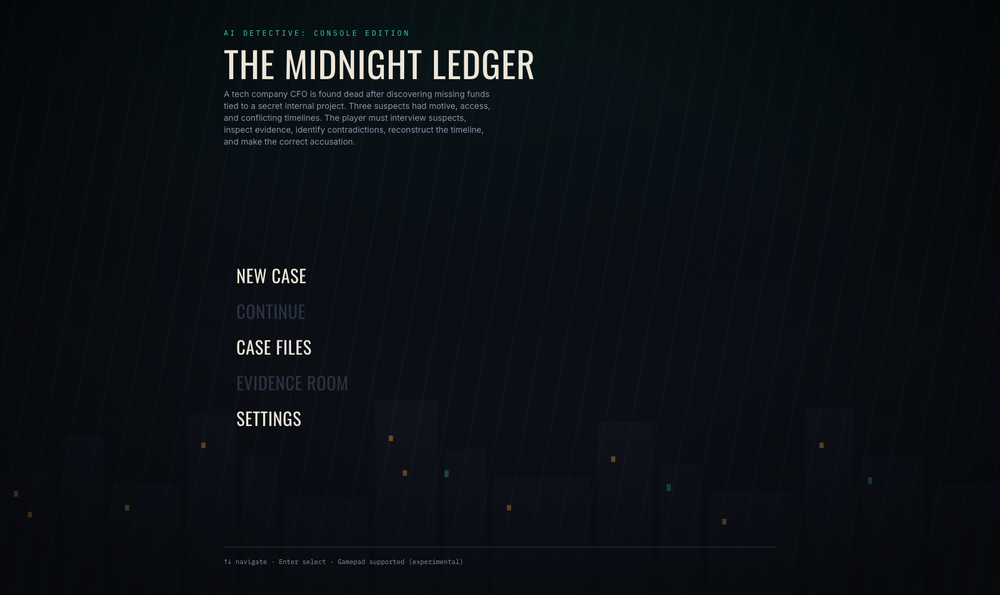
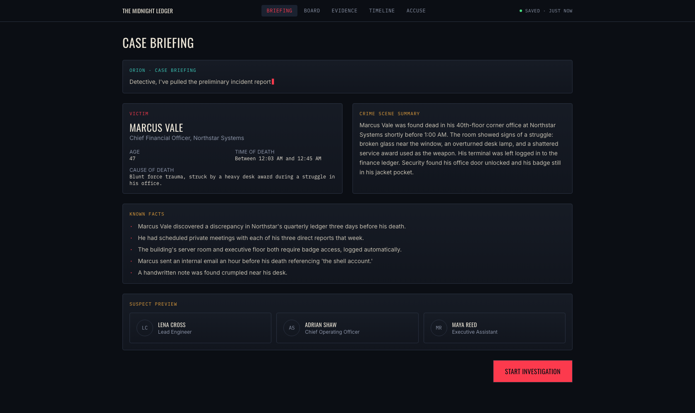
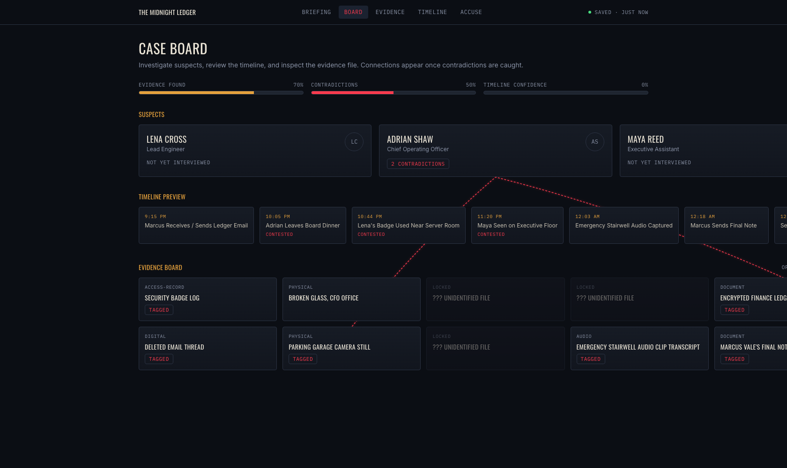
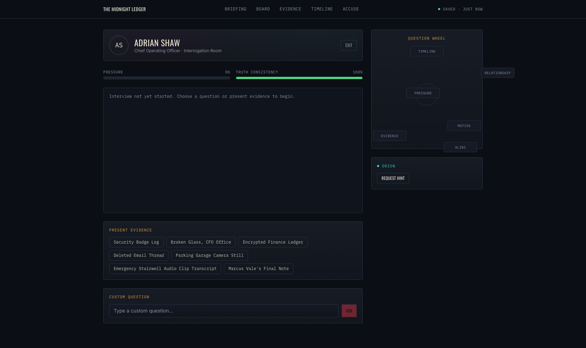
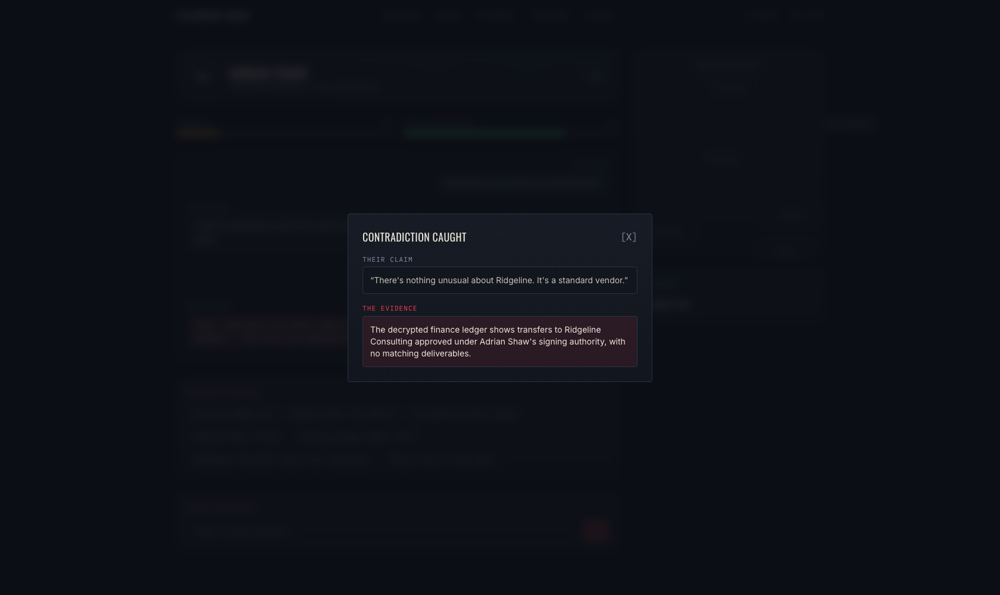
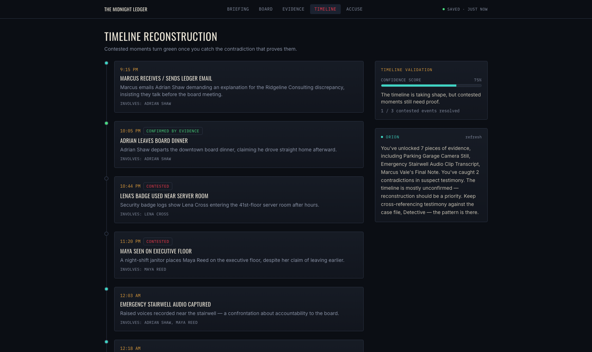
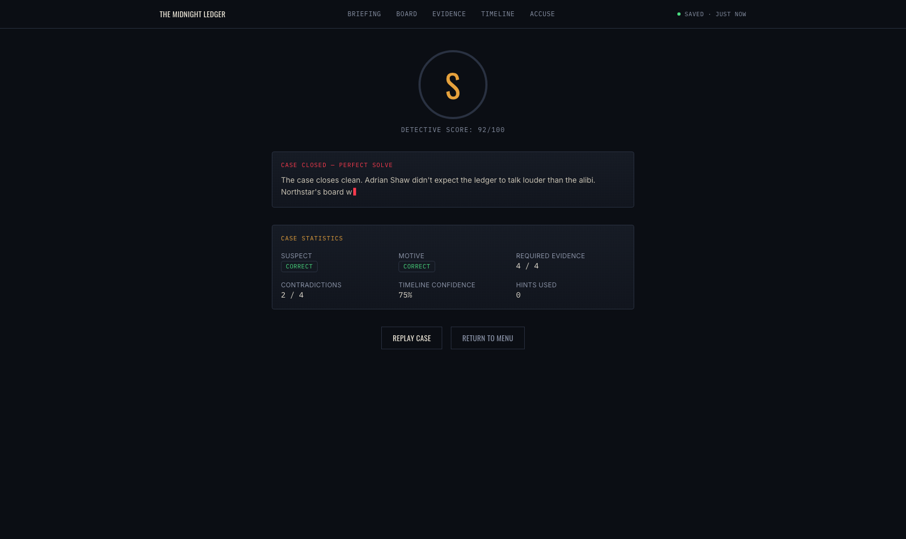
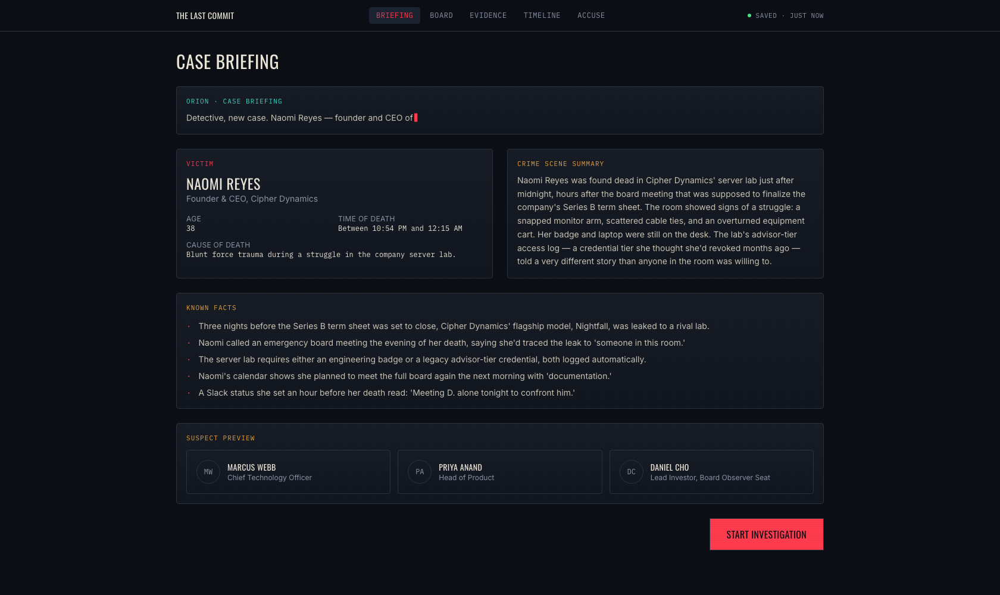
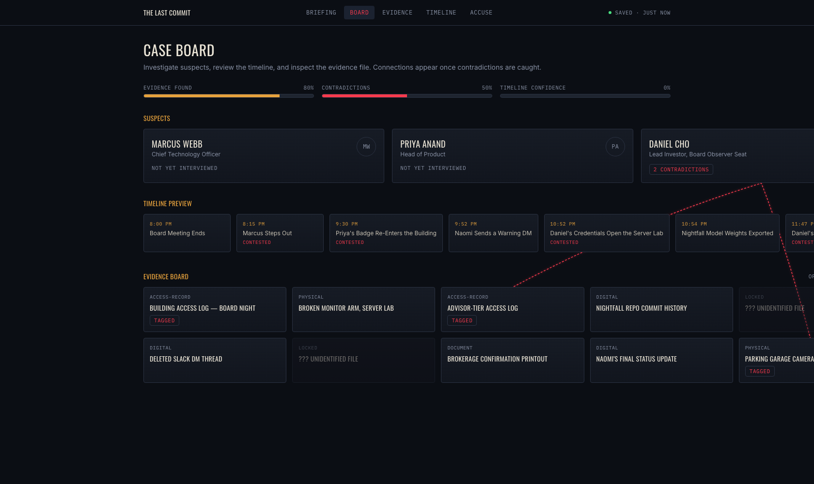
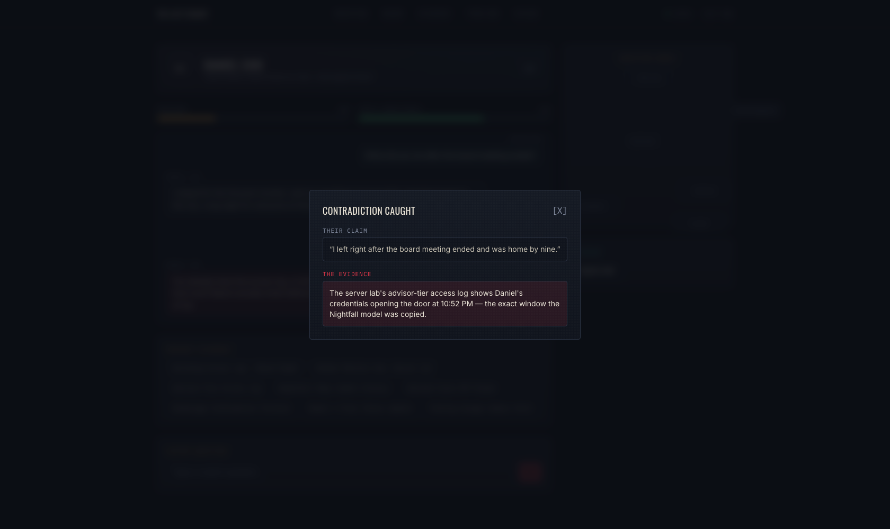

# AI Detective: Console Edition

A cinematic, console-style browser mystery game with **two playable cases** — *The Midnight Ledger* and *The Last Commit*. Interview suspects, catch contradictions, reconstruct a timeline, and accuse a killer.

Built as a portfolio project to demonstrate a full game loop, a multi-case content architecture, an LLM-ready AI system that works with zero API keys, and a distinctive, non-templated UI.

> **Portfolio angle:** Built a console-style AI detective game with LLM-ready suspect interviews, evidence tracking, contradiction detection, save progress, timeline reconstruction, and a cinematic React interface.

**Live demo:** [ai-detective-console.vercel.app](https://ai-detective-console.vercel.app)

## Screenshots

**The Midnight Ledger**

| | |
|---|---|
|  |  |
|  |  |
|  |  |



**The Last Commit**

| | |
|---|---|
|  |  |



## Game Concept

Pick a case from the **Case Files** screen, then play the full detective loop: review the case file, interrogate three suspects (against a mock or live LLM), present evidence to catch lies, rebuild the timeline, and make a final accusation. Your **Detective Grade** depends on who you accuse, what evidence you used, and how much you leaned on hints.

- **The Midnight Ledger** — A Northstar Systems CFO, Marcus Vale, is found dead after uncovering a discrepancy in the company's ledger. Three of his direct reports — an engineer, a COO, and an executive assistant — each had motive, access, and a story that doesn't quite hold up. *(Killer: the COO, covering up a financial fraud scheme.)*
- **The Last Commit** — Cipher Dynamics' flagship AI model leaks to a rival lab three nights before its funding round closes. When founder Naomi Reyes traces the leak to someone in her own boardroom, she turns up dead in the server lab hours later. Her CTO, her head of product, and her lead investor all had something to hide. *(Killer: the lead investor, covering up insider trading on the leak.)*

## Tech Stack

- **Next.js 16** (App Router) + **React 19** + **TypeScript**
- **Tailwind CSS v4** for styling, with a custom noir-tech design token system
- **Framer Motion** for scene transitions, dialogue drawers, and micro-interactions
- **Zustand** for game state, with a hand-rolled `localStorage` save layer
- Provider-abstracted AI layer: **Mock AI** (default, no key needed), **OpenAI**-ready, **Claude**-ready
- Optional experimental **Gamepad API** navigation

## Architecture

```
app/
  page.tsx                       Home / main menu
  cases/                         Case Files — pick which case to start
  case/briefing/                 Case briefing
  case/board/                    Case board (suspects, timeline preview, evidence, red string)
  case/evidence/                 Evidence room (searchable inventory + detail drawer)
  case/suspects/[id]/            Suspect profile
  case/interrogate/[suspectId]/  Interrogation room
  case/timeline/                 Timeline reconstruction + confidence score
  case/accuse/                   Final accusation flow
  case/ending/                   Detective grade + case stats + cinematic close
  settings/                      AI mode, accessibility, gamepad, reset
  api/ai/interview/route.ts      Suspect interview endpoint (provider-agnostic)
  api/ai/orion/route.ts          ORION summary / hint / ending narration endpoint

components/
  ui/          Reusable primitives (GameShell, GameButton, Modal, ProgressBar, TypewriterText, ...)
  home/        Main menu, rainy city background, continue card
  case/        Briefing panel, victim profile, ORION panel, case nav
  board/       Evidence board nodes + the red-string SVG overlay
  evidence/    Evidence inventory, card, detail drawer
  suspects/    Suspect profile, stress/trust meters
  interrogation/ Question wheel, dialogue history, evidence presenter, pressure/truth meters
  timeline/    Timeline board, event cards, validator
  ending/      Detective grade, case stats, cinematic narration

lib/
  game/
    cases/     midnight-ledger.ts, last-commit.ts — one CaseDefinition each; index.ts is the registry
    types.ts   shared domain types (CaseDefinition, SuspectProfile, Evidence, ...)
    scoring.ts, storage.ts
  ai/          provider interface, mock provider, live (OpenAI/Claude) providers, prompt templates

hooks/
  useGameStore, useSavedCase, useGamepadNavigation, useReducedMotion
```

Every case — victim, suspects, evidence, timeline, and contradiction rules — is a single `CaseDefinition` object in `lib/game/cases/`. `lib/game/cases/index.ts` is a small registry (`getCase`, `getSuspect`, `getEvidence`, `getContradiction`) that every page and API route goes through, keyed by `progress.caseId`. Routes like `/case/board` and `/case/suspects/[id]` aren't case-scoped in the URL — they always operate on "whichever case is active," resolved from the save file. Adding a third case means adding one more file to `cases/` and registering it; nothing else in the app is case-specific.

## AI Provider Abstraction

`lib/ai/aiProvider.ts` defines a single `AIProvider` interface (`interviewSuspect`, `orionSummary`, `orionHint`, `endingSummary`). `getAIProvider(mode)` returns:

- **`mock`** (default) — `lib/ai/mockProvider.ts`. Fully deterministic: responses are selected by suspect, question category (or a keyword-classified custom question), stress/trust/pressure state, and whether the presented evidence matches that suspect's contradiction rule. No network calls, no API key.
- **`openai`** / **`claude`** — `lib/ai/liveProviders.ts`. Thin server-side fetch wrappers around the OpenAI Chat Completions API and Anthropic Messages API, built from shared prompt templates (`lib/ai/promptTemplates.ts`). The **game-state deltas (stress/trust/pressure/truth, contradiction detection) are always computed by the same rule engine** regardless of provider — only the suspect's *phrasing* is generated by the LLM. If a live call fails or no key is configured, it transparently falls back to the mock provider.

API routes (`app/api/ai/interview`, `app/api/ai/orion`) call `getAIProvider` server-side, so `OPENAI_API_KEY` / `ANTHROPIC_API_KEY` are never sent to the client.

### Mock AI mode (default, no key required)

Set (or leave) `NEXT_PUBLIC_AI_MODE=mock`. Every suspect has hand-written **calm** and **defensive** response variants for each of the 6 question categories (timeline, relationship, motive, alibi, evidence, pressure), plus a scripted "caught" response (their `truthStatement`) that fires the first time you present the exact evidence that disproves their claim. Custom free-text questions are routed to a category via lightweight keyword matching. This is what ships by default and what the acceptance criteria are built against — **the whole game is playable end to end with zero setup.**

### Live LLM mode

1. Copy `.env.example` to `.env.local`.
2. Set `OPENAI_API_KEY` or `ANTHROPIC_API_KEY`.
3. In **Settings → AI Provider Mode**, pick OpenAI or Claude.

The suspect's system prompt locks in their character, motive, secret, lie point, and truth statement, and explicitly forbids revealing the killer or inventing evidence (see `suspectInterviewSystemPrompt` in `promptTemplates.ts`).

## Case Logic

Each `CaseDefinition` (`lib/game/cases/*.ts`) is self-contained:

- **Evidence** — 10 items per case, each with a category, importance level, source, related suspects, and contradiction tags. Two are visible from the start; the rest unlock when you open a related suspect's profile (simulating forensics compiling that suspect's file as you investigate them).
- **Contradictions** — 4 rules per case, one per suspect lie point, each mapping a specific evidence ID to a claim, a proof, and stress/trust/pressure/truth deltas. In both cases the primary suspect has two lie points (two pieces of evidence disprove the same claim); the other two suspects have one each.
- **Timeline** — 8 chronological events per case; 3 are "contested" until their matching contradiction is caught, at which point the Timeline Confidence score (shown live) increases.
- **Scoring** (`lib/game/scoring.ts`) — grades S/A/B/C/D from correct suspect, correct motive, required-evidence coverage, contradictions resolved, timeline confidence, and hints used. Scoring reads its targets (`correctSuspectId`, `requiredEvidenceIds`, ...) from whichever case is active, so the same function grades both cases identically.

## Save System

`hooks/useGameStore.ts` (Zustand, no persistence middleware — hand-rolled instead) holds all runtime state: which case is active, unlocked evidence, per-suspect stress/trust/pressure/truth and dialogue history, timeline confidence, accusation, ending, and hint count. `lib/game/storage.ts` writes it to `localStorage` under a versioned save key. Settings are stored **separately** from case progress, so changing a setting (or just landing on the home screen) never fabricates a phantom "case in progress." A save is only created once you actually start or continue a case. There is a single active save slot — starting a case from **Case Files** replaces whatever was previously in progress, including a case in progress for the other file. "Continue" always resumes the most recently started case.

## How to Run Locally

```bash
npm install
npm run dev
```

Open [http://localhost:3000](http://localhost:3000). No environment variables are required for the default (mock) experience.

```bash
npm run lint   # ESLint (flat config, Next.js + TypeScript rules)
npm run build  # production build + type check
```

## Environment Variables

See [`.env.example`](.env.example):

| Variable | Required | Notes |
| --- | --- | --- |
| `NEXT_PUBLIC_AI_MODE` | No | `mock` (default) / `openai` / `claude` |
| `OPENAI_API_KEY` | Only for live OpenAI mode | Server-only, never sent to the client |
| `ANTHROPIC_API_KEY` | Only for live Claude mode | Server-only, never sent to the client |

## How to Play

1. **New Case** (or **Case Files**) → pick a case → read the briefing, victim profile, and known facts.
2. **Case Board** → survey suspects, the timeline preview, and the evidence board.
3. Open a **suspect profile** → this unlocks the evidence tied to them → **Start Interrogation**.
4. Use the **question wheel** or type a custom question. Watch stress and trust shift.
5. **Present evidence** that contradicts what a suspect just told you — catching a contradiction updates their truth meter, the timeline, and draws a red string on the Case Board.
6. Check **ORION** (top-right panel) for a case summary, or request a hint during an interrogation (hints cost points).
7. Once the **Timeline** looks solid, go to **Accuse**: pick the suspect, motive, key evidence, and timeline explanation, then confirm.
8. See your **Detective Grade**, case stats, and a cinematic closing narration on the **Ending** screen.

### Demo flow (fastest path to a satisfying demo)

Home → New Case → **The Midnight Ledger** → Start Investigation → Case Board → **Adrian Shaw** → Start Interrogation → ask "What did you do after the board dinner?" → present **Encrypted Finance Ledger** (contradiction #1) → Exit → present **Parking Garage Camera Still** (contradiction #2) → Board (see the red strings) → Timeline (confidence rises) → Accuse (Adrian Shaw / Financial fraud cover-up / all 4 required evidence / "Adrian returned" explanation) → Ending (grade S).

The same flow works for **The Last Commit**: accuse **Daniel Cho** / "Covering up insider trading on the model leak" / the four critical evidence items (Advisor-Tier Access Log, Nightfall Repo Commit History, Deleted Slack DM Thread, Naomi's Final Status Update) / "Daniel never left" explanation.

## Design Decisions & Known Tradeoffs

- **Fixed dark theme, not light/dark adaptive.** The brief calls for a specific noir-tech art direction; that's treated as an intentional, locked visual identity rather than a preference to toggle.
- **Evidence unlocks per suspect, not via a drip-feed script.** Simpler and more predictable than a scripted unlock sequence, while still gating the Evidence Room meaningfully.
- **Red string connections use live DOM measurement** (`getBoundingClientRect`) between registered board nodes rather than a physics/drag system — a deliberate scope cut that keeps the visual signature without a full drag-and-drop board.
- **ORION's case-summary text is fetched once per panel mount**, so it can occasionally lag one state update behind the live meters on the same page (e.g., right after the Timeline Confidence bar updates). The underlying scoring and game state are always accurate; only ORION's narration can be a beat behind until you hit "refresh."
- **Single active save slot, shared across cases.** Starting a case always replaces the current save rather than keeping independent progress per case. Simpler mental model ("your detective is on one case at a time") at the cost of not being able to leave one case mid-investigation and come back to it later without finishing or restarting.
- **Two cases, three suspects each, one perfect solve per case** — sized intentionally as a complete, polished pair rather than a larger but thinner set. The case registry (`lib/game/cases/`) is built so a third case is additive, not a rewrite.

## Future Roadmap

- Additional cases beyond the two included, plus independent per-case save slots
- Procedurally generated cases
- Voice interrogation
- AI-generated evidence summaries
- Branching suspect relationships
- Case editor
- Multiplayer detective mode
- Full controller support
- Animated suspect portraits
- Crime scene exploration
- Portfolio site integration

## Resume Bullet

> Built AI Detective: Console Edition, a browser-based mystery game with LLM-ready suspect interviews, evidence tracking, contradiction detection, save progress, timeline reconstruction, and a cinematic console-style React interface.

## License

MIT
